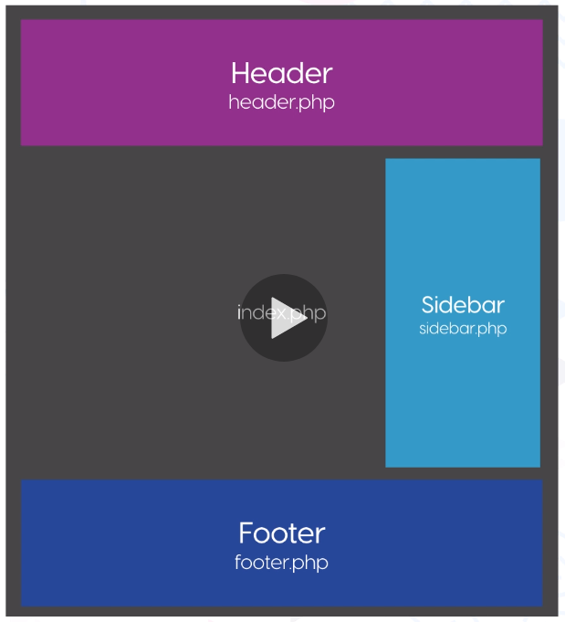
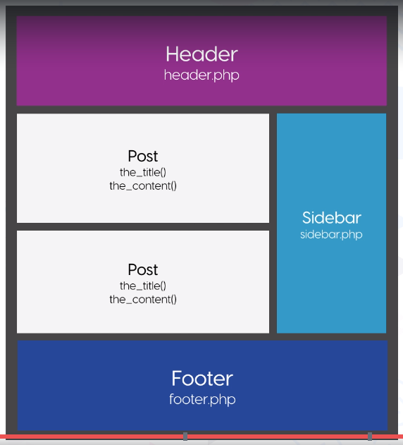

# Section 2 - Lesson 7
# Template Files and Template Tags

## Template Terminology

- Templates files (Lesson 8 & 9)
- Template Tags (Lesson 8 & 9)
- Template Hierarchy
- Page Templates



## Header and Footer

- Trong kiến trúc Hierarchy, hàm ```get_header()``` và ```get_footer()``` sẽ tự động gọi nội dung của file header.php và footer.php tương ứng.
- Nếu code header chứa trong các file khác, ví dụ vertical-header.php => thêm param vào hàm ``` get_header("vertical");```

## Functions

- ```language_attributes();``` : Lấy thông số ngôn ngữ của wordpress.
- ```bloginfo('charset');``` : Setup thông số Charset của wordpress.
- ```wp_head();``` : Chèn các link css của wordpress vào header.
- ```wp_footer();``` : Chèn các link js của wordpress vào footer.

