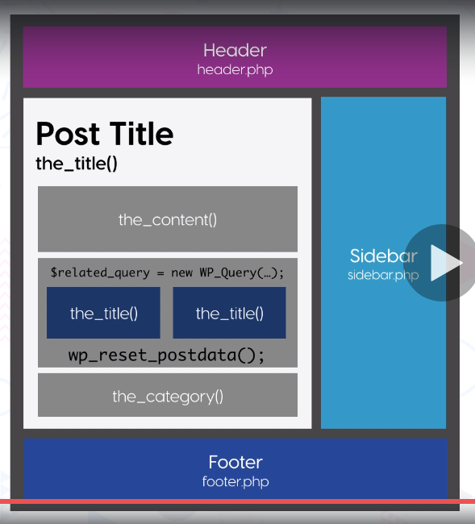

# Section 2 - Lesson 9
# Understanding the Loop

## Get posts by category

- Khi muốn lấy các bài viết (post) theo từng danh mục. Ta sẽ tạo ra một đối tượng WP query mới như sau:
```
$the_query = new WP_Query(array('cat' => 4));
if ($the_query->have_posts()) {
    echo '<ul>';
    while ($the_query->have_posts()) {
        $the_query->the_post();
        echo '<li>' . get_the_title() . '</li>';
    }
    echo '</ul>';
} else {
    // no posts found
}
wp_reset_postdata();
```
- Khi sử dụng tùy biến WP_query, cần phải add hàm ```wp_reset_postdata();``` vào cuối để xóa giá trị được lưu ở biến toàn cục $wp_query và $post.

- Để rõ ràng hơn ta nhìn hình dưới:



- Trong hàm ```the_content()``` đang lấy nội dung của bài post.
- Trong block tiếp theo, ta muốn hiển thị các bài viết liên quan đến post ở trên. Khi đó, ta viết một instance WP_Query mới để lấy danh sách các bài viết liên quan.
- Ở block cuối cùng, ta gọi hàm ```the_category()``` để lấy thư mục của post ở trên. 
  Nếu không sử dụng hàm ```wp_reset_postdata()``` thì category sẽ trả về của post cuối cùng của danh sách các bài viết liên quan và đó là danh mục sai.
