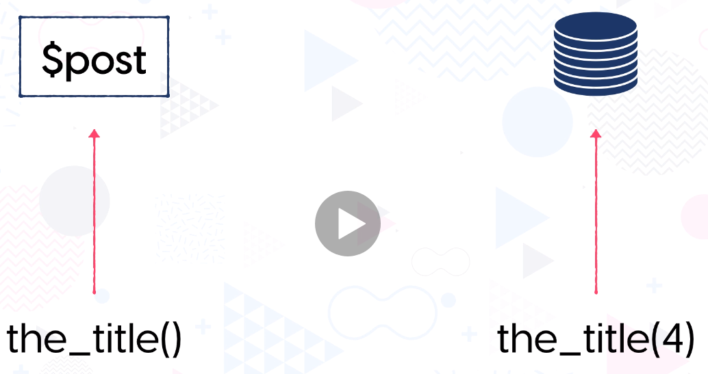

# Section 2 - Lesson 8
# Coding the Loop

## the_title()

- Nếu ko truyền param id lên, hàm sẽ lấy title của biến toàn cục ```$post```.
- Nếu truyền vào id (ví dụ là 4), hàm sẽ lấy title của bài viết có id là 4.



## Functions

- ```have_posts();``` : hàm check sự tồn tại của các bài post. Khi dùng với if là hàm trả giá trị boolean, 
  khi dùng với while là hàm loop thứ tự các bài viết.
- ```the_permalink();``` : hàm lấy link chi tiết của bài viết. Ví dụ: ```http://localhost/2021/01/18/hello-world```.
- ```the_title_attribute();``` : hàm lấy title của bài post (thường dùng khi lấy attribute title của thẻ a). 
- ```the_title();``` : tác dụng như trên nhưng dùng để hiển thị tiêu đề post.
- ```get_permalink();``` : tác dụng giống như hàm ```the_permalink()```.
- ```get_the_date();``` : hàm lấy thời gian tạo của bài viết. Chi tiết param định dạng thời gian truyền vào xem chi tiết
  tại link: [get_the_date](https://developer.wordpress.org/reference/functions/get_the_date)
- ```get_the_author_meta('ID');``` : lấy id tác giả bài viết của từng bài viết.
- ```get_author_posts_url(author_id, author_nicename);``` : lấy url list tất cả bài viết của tác giả X. Ví dụ: ```http://localhost/author/themedemos```
- ```get_the_author();``` : lấy tên tác giả của bài viết.
- ```the_excerpt();``` : lấy trích dẫn X ký tự đầu tiên của bài viết. Thường được sử dụng khi list bài viết ngoài trang chủ.
- ```the_posts_pagination();``` : tạo cụm html phân trang.

- Lưu Ý: có sự khác nhau giữa những hàm có prefix là __the__ và __get__ như sau:
  - hàm có prefix bằng __the__ khi gọi sẽ tự động gọi hàm ```echo()``` để in ra kết quả.
  - ngược lại hàm có prefix bằng __get__ sẽ chỉ là trả về giá trị của nó mà ko kèm theo in ra kết quả.

